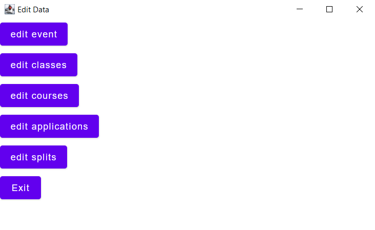
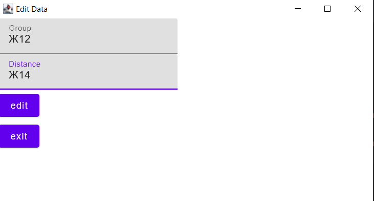
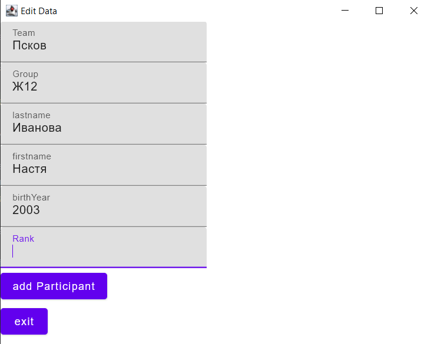

##Режим изменения

Окно изменения выглядит так

В edit event можно изменить название нашего соревнования 

В edit classes возможно изменить для группы дистанцию
Пример корректного заполнения

edit courses аналогично edit clasess

edit applications позволяет добавлять новых участников

Пример корректного заполнения

edit splits позволяет прочитать данные из другого файла

[Выход](Docs.md)