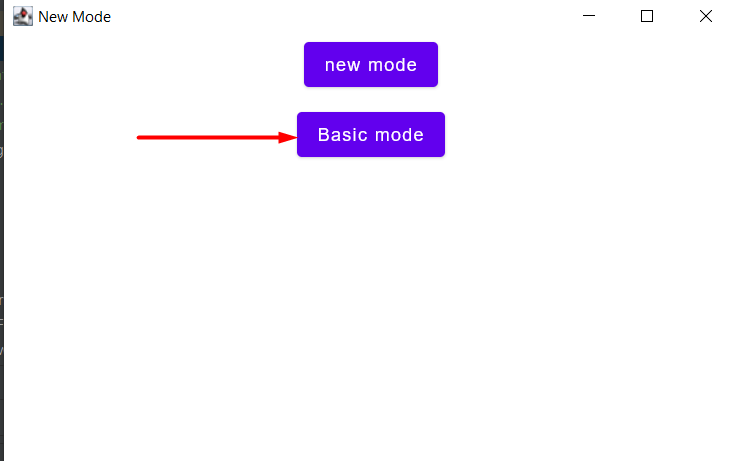

##Отчеты программы
при некорректных данных могут возникнуть сообщения:

* Некорректным мероприятием считается мероприятие с датой, записанной не в формате число.месяц.год
* Некорректной дистанцией считается дистанция, контрольные точки которой записаны не числами
* Некорректная группа это группа, дистанции которой нет в списке дистанций
* Если участник хочет принять участие в группе, которой нет в списке групп данного мероприятия, то участник исключается из мероприятия

[Выход](Docs.md)