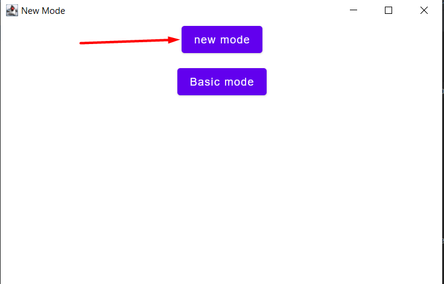
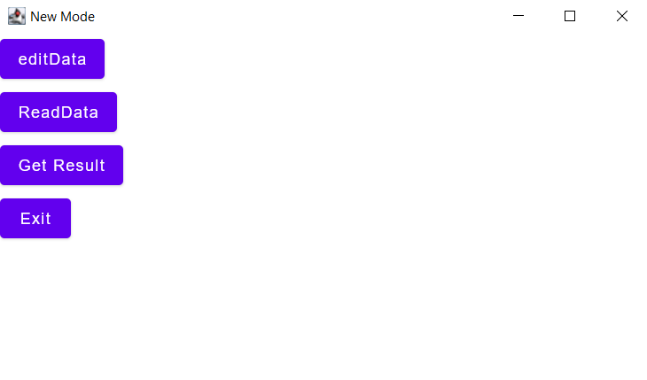
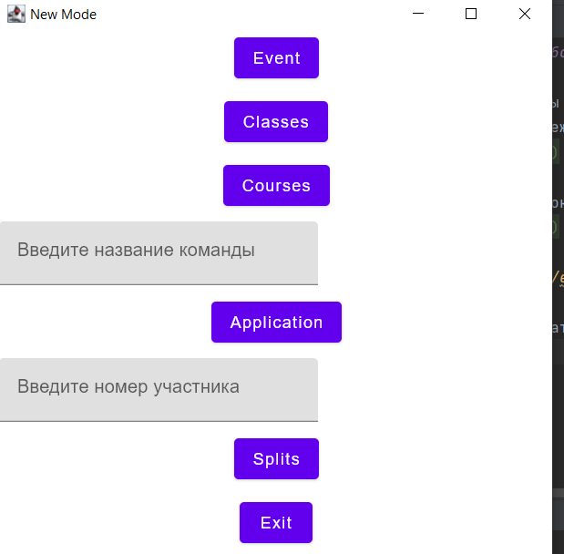

##Продвинутый режим работы

После запуска программы для
запуска продвинутого режима достаточно нажать кнопку base mode

После этого откроется окно с 4 видами взаимодействия с таблицей

[Режим изменения](editdata.md) - позволяет изменять или добавлять данные

ReadData позволяет читать данные
Окно readdata

Get Result строит таблицу результатов

[Выход](Docs.md)
