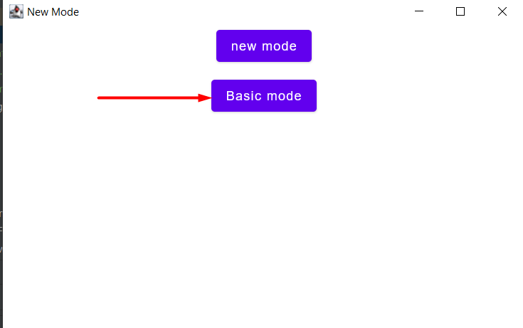
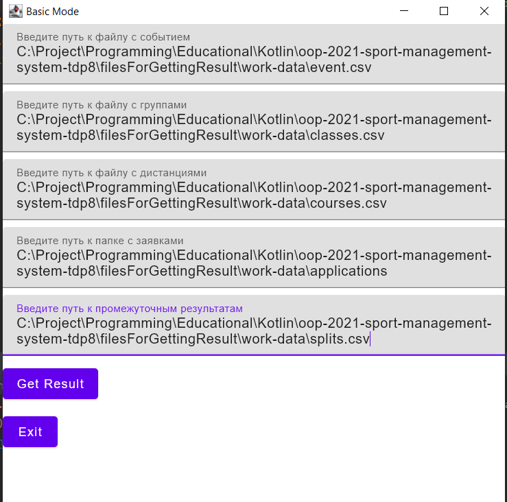
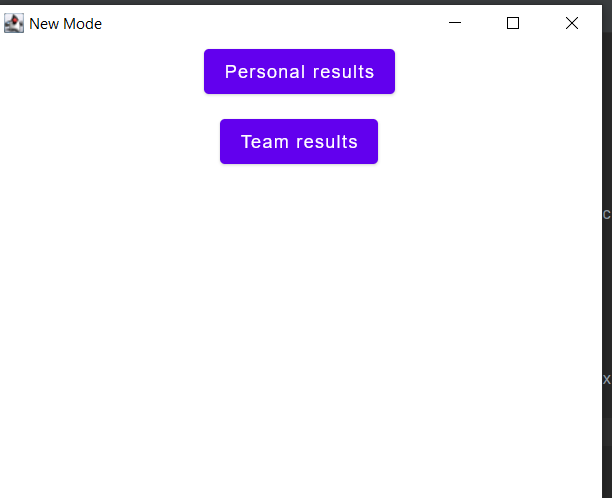
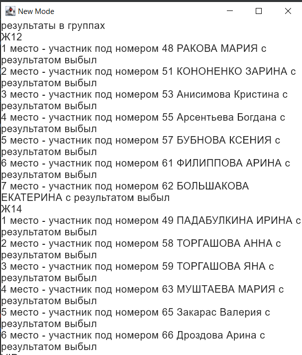

##Базовый режим работы

После запуска программы для 
запуска базового режима достаточно нажать кнопку base mode

После этого откроется новое окно в котором можно записать все cvs таблицы

Пример корректного заполнения 

После этого вы можете посмотреть результат группы или отдельных участников

 Например результаты в группе

[Выход](Docs.md)
